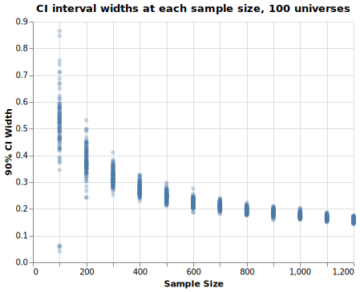
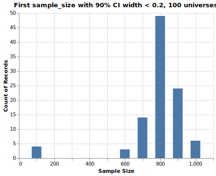
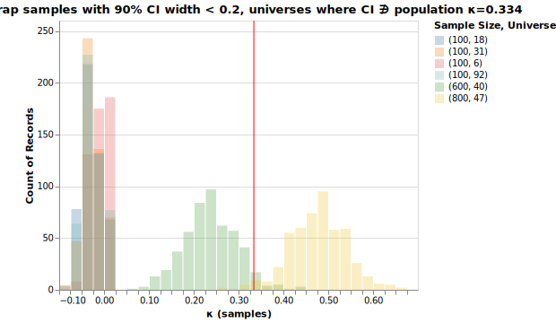

<meta name="twitter:card" content="summary_large_image">
<meta name="twitter:site" content="@pmbaumgartner">
<meta name="twitter:creator" content="@pmbaumgartner">
<meta name="twitter:title" content='Bootstrapped Sampling for Annotation: A Multiverse of Madness?'>
<meta name="twitter:description" content="Giving Dr. Strange some company.">
<meta name="twitter:image" content="https://i.ibb.co/8bbhQYq/multiverse-mountains.png">
<meta property="og:image" content="https://i.ibb.co/8bbhQYq/multiverse-mountains.png">

> *Note*: If you haven't read my [prior post](/blog/how-much-data-bootstrap-irr) on the bootstrap and inter-rater reliability, this post probably won't make sense. Go read that first.

After I had began discussing my last post with a few people, they had begun to replicate my analysis. Their replications raised an important issue I hope to address here: estimation is dependent on the initial sample of annotations that we have.

What I failed to mention is that in the original example we were annotating data in a specific _universe_[^1]. If you recall we were annotating examples incrementally by 100s until our 90% confidence interval was less than 0.2. But what determined the order those examples being annotated? In the example with the GoEmotions dataset of reddit comments I had sorted by comment creation date but failed to mention this in the blog post. It turns out that the order in which examples are annotated really matters, and in that specific universe things went pretty well.

Let's take a step back and enter two alternate universes where we had annotations for the the "disapproval" label (all examples in this post are using annotators 4 & 61 on the "disapproval" label). In these two alternative universes I have two different random sampling processes that pull in new examples to be annotated. When I perform the bootstrap at 100 examples for both of these universes, here are the results:

These are two _very_ different universes! In one universe, my kappa is looking quite good, with large variation. In the other, it's looking awful - and the confidence interval is quite narrow!

So what's the deal here? Well, we have to enter the multiverse to find out.

## Entering the Multiverse

To evaluate the variability and dependence upon the annotation order I created 100 universes (simulations) wherein each universe a new random sample of all annotations was generated. Using this new sample, we re-run the same experiment in the original blog post, iterating by 100 samples through each of those annotations and identifying the iteration where we had enough examples that the 90% CI width was less than 0.2. 

With this we can evaluate what the width of the confidence interval would be for each of these multiverses and get a sense of their variability. Here's a plot of the width of the confidence intervals, for each sample size, for 100 multiverses:

We can see the variability at n=100 is quite large! The confidence interval widths range almost the full range of positive values.

This highlights a limitation of our approach, which is that it's highly sensitive to the initial sample of overlapping annotations. But the limitations don't stop there! Recall that we were using a width of the CI as our stopping criteria, and we decided that when we achieved a width of < 0.2, we would stop. In our original analysis, this meant we stopped at n=700 annotations. But we can see from the chart above that even there we got lucky! Most of the CI widths at n=700 were greater than 0.2! We don't see _most_ of the widths getting below 0.2 until n=900, and a majority of them until n=1000!

In fact, here's a chart of the first sample size (what we've been referring to as iteration) where a CI width under 0.2 is achieved for each of the 100 universe simulations:

Now if we look at all of these universes that met the stopping criteria, we should check whether the confidence interval in each of those universes contains the "true" value of kappa - `0.334`. When we do that, we discover that 94 of them do and 6 of them don't[^2]. That's close to what we would expect since our confidence interval was 90%! Great job, statistics!

For more practical matters, let's view the properties of those multiverses where the CIs do not contain the true value when we meet our stopping criteria. Here's all of these universes, in a single plot to see their distributions.

There are two general classes of failure modes here. In the first case we have universes where at 100 samples we met our stopping criteria. In all of these cases, our estimate of `κ` is less than 0 - we have no agreement. In the other case, we stopped at a reasonable sample size but the samples don't converge around our population value - they're displaced slightly off of the population value. 

## What to do?

The main problem is that we don't know what universe we're in when we're actually solving this problem. I think the best course of action here is to be aware of these failure modes and question what your results are showing us.

In the first case, when we've only got 100 annotations and we're getting low agreement, the solution is to annotate more. Unless we have designed an extremely challenging novel task, it's very unlikely that we have no (or negative) agreement between two annotators. It's also important to consider the base rate of your task - if we're annotating something that's quite rare, then it doesn't take many examples to get a scenario where it looks like there's no agreement on the positive examples. In each of the instances here, if we were to annotate 100 more examples, for a total of 200 annotations, the CI width bounces back to a more realistic value (~0.35). Basically: 100 annotations will probably never be enough, unless we have a very well defined task with a balanced labels.

In the second case, when we have annotated a fair amount of examples and the 90% CI simply fails to capture the true value, lets consider the counterfactual this presents us. There were two types of scenarios here: one where our estimates were around 0.22, and another where they were around 0.44. In either case the kappa values are low. In the 0.22 case, that would tell us we need to reframe our annotation task because of low agreement. In the 0.44 case we need to consider whether that's a reasonable rate of agreement for your task. Absent some other context, I'd say that's still not quite good enough and we should redefine our task. Remember how the kappa values were correlated with F1 scores? We'd be looking at a 0.6-0.7 F1 with that level of value. Of course, we can never know this while we're doing the task and this relationship might not generalize to all problems, but values of `κ < 0.6` generally indicate [poor agreement](https://www.ncbi.nlm.nih.gov/pmc/articles/PMC3900052/).

Another option is to explore the source of the underlying disagreement in depth. Maybe we've selected two annotators that have very different conceptions of "disagreement" and are interpreting the annotation guidelines differently. In this case, we could add a third annotator and use a [different metric](https://en.wikipedia.org/wiki/Fleiss%27_kappa) to measure agreement. Another possibility is that the examples we've selected are genuinely difficult to annotate given our guidelines. We should review both the examples where there was agreement to understand their common features and explicate that in our annotation guidelines. We should also review those examples with disagreement and determine what features of those examples might have led to different annotations. Finally, remember that we went through the process of annotating data and we're not just going to throw this away - we should use something like [Prodigy's review recipe](https://prodi.gy/docs/recipes/#review ) to start building our gold dataset for evaluation.

Finally, we could always change the stopping criteria to be more strict - we could increase the confidence interval to 95% or reduce the width to something like 0.15. However, the set of failure modes with low agreement might still occur here: because of the annotations available in those universes, we'd still likely see very tight CIs at 100 samples.

## Wrap Up

Now that this topic spans two blog posts, let's summarize the problem and what we've learned.

**Summary:** For machine learning projects, we want to know how much data we need to annotate to get an accurate model. However, we don't know a lot of aspects about our problem—for example the base rate or difficulty of the annotation task—that would allow us to make a decision about how much data we need to annotate. Using inter-rater reliability (IRR) or inner-annotator agreement (IAA) metrics calculated from two or more annotators performing the annotation task can give us some information about our problem that will give us a better understanding of how much data we need to annotate. These metrics, when combined with bootstrap sampling, can be used to define a stopping criteria for an annotation project, allowing us to annotate _just enough_ data to give us confidence in our metrics. A limitation of this methodology is that estimation is sensitive to initial conditions, specifically the order that examples are annotated. Because of this, we should be cautious in interpreting unlikely outcomes like no agreement and investigate disagreements in-depth. And of course, when in doubt: annotate more data.

[^1]:  A commonly overlooked mistake.
[^2]:  This will change depending on the random seed used.