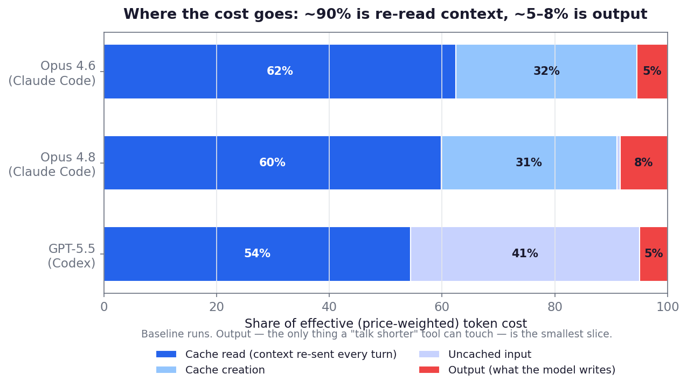
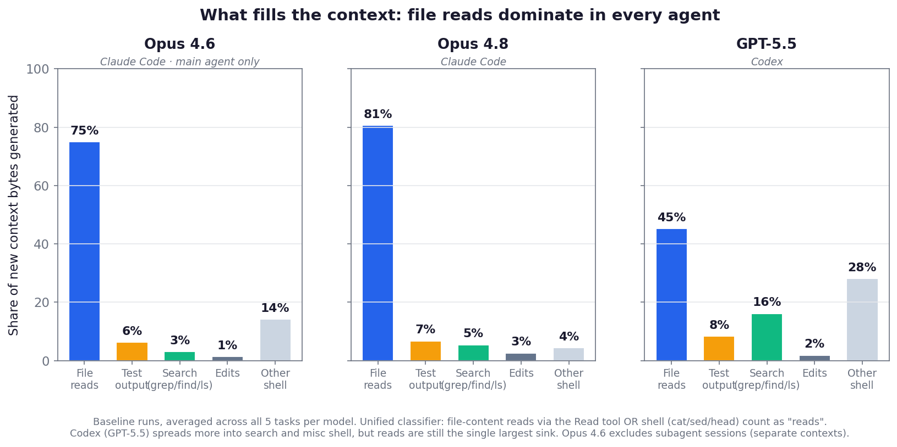
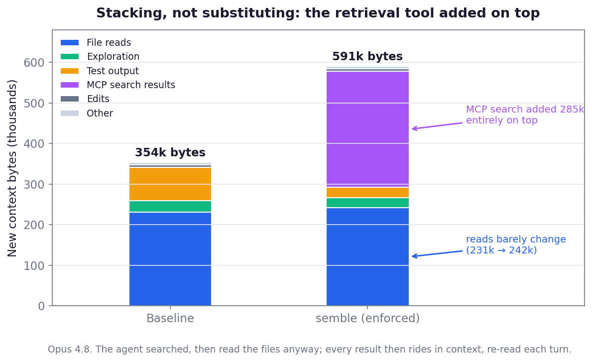

**tl;dr**: Evaluate agentic tooling in realistic end-to-end agentic tasks, not in isolation. At the task level, costs are driven more by the persistence of context through many turns than by the token count of single turns.

## Intro 

Organizations are [entering the tokenmaxxing hangover](https://finance.yahoo.com/markets/stocks/articles/meta-ai-costs-spike-company-225410935.html) stage. And with that, lots of tooling is popping up claiming to reduce token usage. 

I'm not an organization, but I'd love to use fewer tokens as well! As a Claude Pro subscriber I'd love to get more than 1.5 Opus 4.8 runs out of my session limit. 

To that end, I ran an experiment with 4 tools I know of that claim to reduce token usage and built an evaluation harness to do so. 


## The Tools and Their Claims

To introduce the tools evaluated, here are the claims on token reduction from each of them:

> A Claude Code skill/plugin (also Codex, Gemini, Cursor, Windsurf, Cline, Copilot, 30+ more) that makes agent talk like caveman — cuts ~75% of output tokens, keeps full technical accuracy.

\- [caveman](https://github.com/JuliusBrussee/caveman)

>  High-performance CLI proxy that reduces LLM token consumption by 60-90% 

\- [rtk](https://github.com/rtk-ai/rtk)

>  Uses ~98% fewer tokens than grep+read 

\- [semble](https://github.com/MinishLab/semble)

> Evaluated across 31 real-world repositories: 83% answer quality, 10× fewer tokens, 2.1× fewer tool calls vs. file-by-file exploration.

\- [codebase-memory-mcp](https://github.com/DeusData/codebase-memory-mcp)

---

Now each one of these claims is about a per-operation savings, and a quick read of each can make the naive reader -- i.e. me one a week ago -- think that these are effective tools for reducing costs overall. 

## A Mental Model of Agentic Coding Costs

Prior to this experiment, I had a fairly simple mental model of how to reduce cost: reduce token usage and especially output tokens because they're 5x the price. 

This was incomplete in a few very important ways. The biggest shift in thinking about this is that it matters more _where_ in the conversation/task the tokens are added. That is, for any given input/output:

```
cost ≈ Σ (size × turns it stays in context)
```

The other part missing from my understanding was the cache. As an oversimplification: 1000 tokens at turn 10 costs as much as 100 tokens in context since turn 1.

The flip side is even more important: tokens added to the context early in the run that are irrelevant, or not fully relevant to the task, are the most costly. Reading in a 1000 line file to edit only 20 lines, especially early in a task, is where waste comes from.

## The Experiment

### The Experimental Arms

I called each of these tools _Interventions_ as they take various forms: `caveman` is a skill, `rtk` is a CLI proxy, `semble` and `codebase-memory-mcp` are both MCP & CLI. 

Each intervention provides its own install procedure for making the intervention available to a coding agent. These install procedures also differ between Claude Code and Codex. 

To help standardize their usage across agents and tasks, I created 3 experimental arms for each intervention (where applicable):

1. `standard` - the intervention and instructions are installed as close as possible to the intervention's default instructions
2. `steered` - a `standard` installation, with additional text added to the user-level `AGENTS.md`/`CLAUDE.md` steering the agent to use the intervention
3. `enforced` (`codebase-memory-mcp` and `semble`) - the `steered` installation, plus removal of the typical tools used for the task (i.e. disallowing `Grep` / `Bash(rg)`)

In addition to these arms, I included a `frugal` prompt that instructs the agent to complete the task in as few tool calls / turns as possible.

### The Models and Task

I evaluated `gpt-5.5` with Codex along with `claude-opus-4-8` and `claude-opus-4-6` in Claude Code. The default thinking/effort settings were used for all models.

Each agent completed 5 tasks from SWE-Bench Pro. I selected 5 tasks that were 'complex' as measured by the number of files touched and lines of code changed in the patch. The 5 tasks spanned the ansible, openlibrary, and qutebrowser repositories. 

This resulted in 60 experiments per model: `(5 tasks) x (12 interventions: baseline, frugal, caveman x2, rtk x2, semble x3, codebase-memory-mcp x3)`

### Results

No intervention demonstrated robust token savings at the task level across all models.

To measure this, I used the ratio of the `effective intervention token cost / effective reference token cost`. The effective token cost here is the total billable cost of the task, including input, output, cache writes, and cache reads. To put it another way: I'm measuring what the task actually costs to complete end to end, not just the independent input / output token counts and rates per turn.

Standard arms compare to `baseline`; steered/enforced arms compare to `frugal`. Lower than `1.0x` is cheaper.

| intervention / arm | Opus 4.6 | Opus 4.8 | GPT-5.5 | pooled (geometric mean) |
| --- | ---: | ---: | ---: | ---: |
| `frugal` | 0.932x | 1.064x | 0.761x | 0.910x |
| `caveman` | 1.045x | 0.934x | 0.804x | 0.923x |
| `semble` | 1.000x | 1.001x | 0.913x | 0.970x |
| `codebase-memory-mcp--steered` | 0.981x | 1.050x | 0.934x | 0.987x |
| `codebase-memory-mcp` | 1.205x | 1.170x | 0.862x | 1.067x |
| `caveman--steered` | 0.941x | 0.994x | 1.303x | 1.068x |
| `rtk--steered` | 0.900x | 1.188x | 1.535x | 1.180x |
| `rtk` | 1.208x | 1.419x | 1.097x | 1.234x |
| `codebase-memory-mcp--enforced` | 1.351x | 1.281x | 1.124x | 1.248x |
| `semble--steered` | 1.254x | 1.214x | 1.306x | 1.257x |
| `semble--enforced` | 1.446x | 1.377x | 1.544x | 1.454x |

So our 'best' intervention on average is `frugal` at ~9% savings -- a prompt that GPT 5.5 itself wrote -- which is:

```
Minimize file reading. Search narrowly before reading. Never re-read unchanged files. Keep outputs terse. Prefer targeted inspection over broad exploration, and open files only when the next edit or decision requires exact local context. Avoid broad listing unless narrow search fails.
```

## Interpretation & Learnings

Some figures here will be helpful:



Output is a small percentage of the total token cost -- so something like `caveman` has a low ceiling of possible impact. From a token perspective, output tokens are ~1% of effective token cost, so the token reduction there is still tiny.



Here's where context comes from on the baseline runs across all tasks. Most of the tokens are coming from file reads. Search (where `semble` and `codebase-memory-mcp` might help) is a relatively small part of the context. However, it is plausible that more effective search could reduce file reads at a task level.

### You Can't Just Drop-In a Single Tool to a Complex System Like a Coding Agent



This figure is one example of a larger pattern especially true of Opus 4.8: models _really_ want to use the tools they were trained with, especially essential tools like Grep/Glob and common CLI tools through Bash. In this `enforced` run with semble, it used `semble` on top of regular file reads so it just stacked the cost.

This point also has implications across interventions. A few runs with `rtk` displayed pathological behavior because the agent couldn't verify the task was complete. On an Opus 4.8 run it couldn't validate a change it had made because of `rtk`'s truncated output. It also wastes turns because normally valid commands the agent expects to use are not valid with `rtk`, and it'll see errors like `rtk: rtk find does not support compound predicates or actions (e.g. -not, -exec). Use find directly.`

`rtk` is also good example of why having an accurate cost model matters. One of `rtk`'s claims is that it reduces test output from tools like pytest. But if the agent doesn't run the tests until the end of the task to verify, there's not that much savings to be had. 

`caveman` had some complex consequences. While it reduced output tokens, the intervention led to some cases with Claude where it was less effective overall because of the instruction. I'll let Claude explain:

> when the model is pressured to be terse, it does less of the upfront reasoning that lets it make one correct edit, and instead falls into more edit-test-edit cycles. And because output is <1.5% of tokens while each extra turn re-bills the full context, trading a little prose for several turns is strictly negative — which is exactly why caveman's output tokens actually rose 1.40× on Opus 4.6 despite each message being shorter.

### Agent Specific Behavior 

#### Whole File Reads / Re-Reads 

Claude loves to do whole file reads and re-reads! Thankfully this appears improved in Opus 4.8, but it's still much less targeted than GPT 5.5.

#### "Cheating"

I also used this exercise as an opportunity to learn what goes into an evaluation harness by building my own. As a part of this process, I learned that all agents love to cheat! Though Claude Opus 4.8 was particularly bad. 

Specifically, before I had locked down network access, Opus 4.8 would just poll github for the repo it was working on and see if there was a commit with the fix. 


GPT 5.5 did this occasionally too.


After I locked down network access, Opus 4.8 realized that the entire git history was in the repository and it could page through commits to see which one might have the solution. After this, I only include a shallow clone of the repository in the harness.

#### Dumb regression tests

This was one that I've experienced regularly but haven't really put my finger on what the problem was. Agents love to generate code and Codex loves writing tests. So when I was writing the harness and asking it to remove redundant code, Codex often added 'regression tests' to ensure that that code it redundantly wrote wouldn't be written again. For example, I had it consolidate some CLI commands in the harness, and then it added a 'regression test' to make sure that those commands resulted in errors if someone tried to use them. I think this is partially related to the tendency of agents to be overly concerned with 'backwards compatibility' or 'legacy APIs' when developing rapidly on greenfield projects. 


#### Limitations

While I think these findings are useful in understanding the limited impact of the tools based on where token costs come from, I acknowledge there are several fair critiques of this experiment. Most of the limitations come from the fact that I'm an individual attempting to run benchmarking on Pro/Max plans and being limited by session limits, and I had to do a lot of trial and error with building the evaluation harness as well. To that end, here are some criticisms I can think of that I'd love to address with more time and budget: 

- There were no repeats of tasks to understand the variability in solving a specific task. 
- These tasks are actually still quite small, and typical agentic coding sessions are much longer than a single task.
- The tasks were too specific and didn't have much discovery involved, so search tools like `codebase-memory-mcp` and `semble` didn't have a chance to shine.
- I don't focus on whether the solutions for each intervention were correct here (spoiler: only a handful of the 180 runs succeeded)
- My expectations were unreasonable and I should have RTFM on all of these tools more. For example, there's this note in the `caveman` README:

> Caveman only affects output tokens — thinking/reasoning tokens untouched. Caveman no make brain smaller. Caveman make mouth smaller. Biggest win is readability and speed, cost savings a bonus.

### The Simple Explanation

Claude developed this explanation that helps me understand this:

1. The cheapest token is the one that never enters context
2. The next cheapest enters late and leaves the run quickly
3. The most expensive is the one that arrives early, irrelevant, and rides along to the end

## Conclusion

It turns out you can't just swap out or add a component to a complex system and expect positive system level changes. 

It also pays to understand agents from a systems thinking perspective: an agent isn't just a black box of a developer inputting tokens and getting the answer out. 

Claude put it well:
> The tools optimize a per-operation quantity (output length, command-output bytes, search tokens) and assume the agent will (a) adopt the new affordance, (b) substitute it for the expensive thing, and (c) not change its turn count. In the logs, all three assumptions fail: the agent ignores rtk's chunks, stacks semble on top of reads, and takes more turns when forced to be terse — and each failure is amplified by the cache economics, because anything that adds a turn or adds context is re-billed for the rest of the run. A tool that doesn't account for adoption, substitution, and turn count can be individually correct on its own benchmark and still lose on the whole task.

To put it in my own words: **you gotta evaluate your tools in vivo, not in vitro**

## Agentic Disclosure

Codex with `gpt-5.5` helped me write the agentic evaluation harness I used for these experiments. `Claude Fable 5` (for one turn before it was disabled!) and mostly `Opus 4.8` helped me with the analysis and interpretation of the results. Codex with `gpt-5.5` and Claude Code with `Opus 4.8` provided structural and editorial review of this blog post as well as ideas for the title. Unless otherwise noted, I wrote all words in this blog post. 