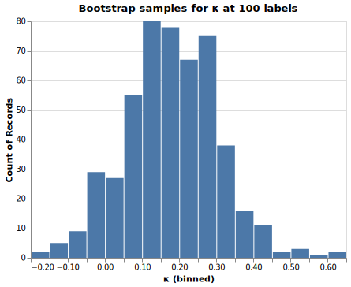
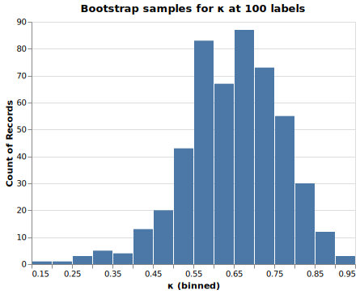
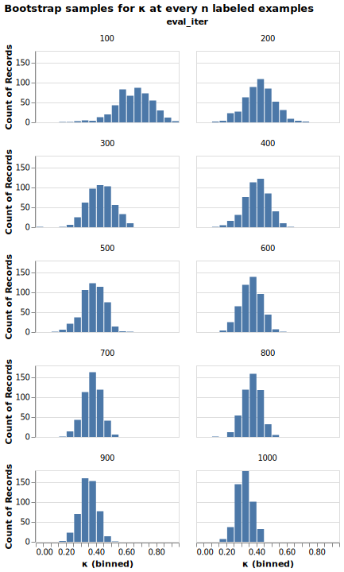
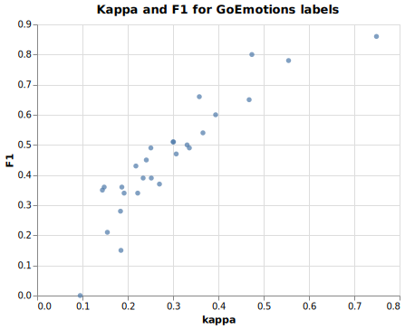

<meta name="twitter:card" content="summary">
<meta name="twitter:site" content="@pmbaumgartner">
<meta name="twitter:creator" content="@pmbaumgartner">
<meta name="twitter:title" content='"How much data do I need to label?"'>
<meta name="twitter:description" content="Let's do the bootstrap and find out!">
<meta name="twitter:image" content="https://i.ibb.co/0rNMYXV/facesweird.png">

One of the most frequent questions I get is "How much data to I need to label?" When I get this question, I usually ask a few questions in return: what's the base rate of the outcome that you're labeling? Are you experimenting or building a production-ready system? How ambiguous or well-defined is your annotation task? Is all of your data ready to be annotated[^1], or do you need to figure out some preprocessing to get an annotation-ready dataset?

There's a problem with all of these questions though: **often times we don't know the answer to these questions when starting a project, we only know them in hindsight.**

I was thinking about this issue the other day during a discussion of the data required for calculating [inter-rater reliability](https://en.wikipedia.org/wiki/Inter-rater_reliability) (IRR) measures. I think IRR is one of the most useful and least discussed ideas in machine learning. Here's the idea: if we're performing some labeling task, an IRR measure gives us an idea of often how two or more people agree on a label. There's a huge advantage to knowing this: if two reasonable humans don't agree how things should be labeled, a machine learning model is going to have a hard time making reliable predictions on future data. Additionally, without multiple annotators, we might be biasing a model towards decisions of a single annotator - or at least a portion of the training data is biased from a single annotator from a pool. That's going to be bad news when, in-production, a user inputs a piece of data similar to one a single annotator labeled, possibly incorrectly, and gets an unhelpful prediction.

Hopefully it's clear IRR is useful after having labeled data, but how can it help us know how much data we would need to label? Enter [the bootstrap](https://en.wikipedia.org/wiki/Bootstrapping_(statistics))!

Bootstrap sampling, or bootstrapping, is an intuitive idea proposed by Brad Efron in a [1979 paper](https://projecteuclid.org/journals/annals-of-statistics/volume-7/issue-1/Bootstrap-Methods-Another-Look-at-the-Jackknife/10.1214/aos/1176344552.full). Rather than doing traditional statistical estimation, with bootstrap sampling we sample with replacement from the data that we have, calculate some measure, save that measure's value, and repeat the process some number of times. The end result of this is a distribution of the measure of interest. With this distribution we can do helpful things like calculate the mean, median, or confidence intervals.

Now let's merge the two ideas of IRR and bootstrapping together. Let's say we have a large pool of unlabeled data we're looking to label. We don't have any prior information about our task like the base rate or the difficulty of the task. What we're going to do is start the annotation task by having two annotators label every example, then after `n` examples are double labeled, estimate some IRR measure with the bootstrap. Since we have a distribution of IRR values, we can now set a helpful stopping criteria: we can stop annotating when a confidence interval is narrower than some specified width. This means we don't have to know what the "true" (population) IRR would be if we labeled all the data, only that we want to be fairly confident about knowing approximately what it is given some number of examples less than the full dataset.

## An applied example

Labeled datasets with multiple annotators are rare ([Vincent has a short list](https://koaning.io/til/2022-10-07-annotation-datasets/)), so we'll use the [GoEmotions](https://arxiv.org/abs/2005.00547) dataset. For simplicity, we'll only focus on two of the labels ("approval", "disapproval") from two annotators (4, 61) who had the most overlapping annotations (`n=2,752`). We'll use [Cohen's Kappa](https://en.wikipedia.org/wiki/Cohen%27s_kappa) (`κ`) as our IRR measure.

We'll pretend we don't have any labeled data and do a hypothetical simulation of how this would work in practice. What we're going to do is pretend we're starting from scratch with this dataset and we have a bunch of unlabeled reddit comments, and we're going to have both annotators annotate all examples, and every 100 annotated examples we're going to review the bootstrapped estimates of `κ`.

Our threshold for ceasing dual annotation and reviewing our task will be when the 90% confidence interval has a width of less than `0.2`. That's a bit arbitrary, but when interpreting `κ` typically a new interpreted level of agreement occurs [every `0.2` interval](https://www.statology.org/cohens-kappa-statistic/).

### Annotating "approval"

For examples labeled "approval", the true (population) `κ` is `0.197` for Annotator 1 & 2. This is the value we'd get if both annotators labeled all examples - a piece of information we have in hindsight, but not one we would have in our simulation. Annotator 1 had 496 positive labels, Annotator 2 had 322 positive labels, and they both agreed on 127 positive examples.

Let's pretend they've labeled the first 100 examples and calculate the bootstrap for `κ`. We'll collect 500 samples of `κ` by sampling with replacement from our 100 annotated examples and calculating the value.

From this chart we can see a few things: our sample range from no or random agreement (<0) to fair agreement (>0.5). It should be clear that we have very little confidence in what the true value of `κ` would be. The 90% confidence interval ranges from -0.030 to 0.383 - a width of about 0.4. We can conclude that at 100 labeled examples, we should continue labeling.

Let's pretend we continued this exercise, evaluating every 100 examples. Here's what that would look like up to 1000 examples:

We can see our estimate of `κ` getting narrower and narrower. If we were to look at the distributional statistics for each iteration, we would find that we could stop annotating with overlap at 400 examples, when the confidence interval is 0.003 to 0.194 - a width of 0.191, which is less than 0.2. 

One other thing to notice here is that the median value of `κ` at `n=400` is 0.12, and our confidence interval doesn't contain the true value of `κ`. This is a potential downside of this methodology[^3]. We're subject to the order in which we're annotating examples and the samples that can be drawn from those examples. If we look back at the chart that continues this process, we'll see the distributions start to center around the true value as add more examples. However, if we were actually doing this process in reality, we'd stop annotating here and never get to that correction with more samples.

### Annotating "disapproval"

We'll repeat this exercise but now with the "disapproval" label. For this label, the true `κ` is `0.334` - slightly higher agreement than for the "approval" label. Annotator 1 has 251 positive labels, Annotator 2 has 132 positive labels, and they overlap for 72 positive labels.

Let's look again at what the bootstrapped distribution of `κ` would look like if we only labeled 100 with overlap.

Here we see the values range almost the full scale of positive agreement values. The center appears to be a bit higher (median=0.660), but with this much spread it's hard to say anything conclusive (except that we need to keep annotating).

Here's what the distributions look like as we continue the experiment every 100 annotations.

For this label the variability of the distributions is much wider across all iterations. Following our stopping rule would mean we would have annotated 700 examples, when the 90% CI is 0.269-0.464, with a width of 0.195.

### Summary & Implications

Double annotating 400 and 700 examples in a binary classification task seems like a lot, right? But think of the costs of proceeding without an analysis like this: you end up wasting a lot of time and resources on generating a dataset on an under-specified task and generating lots of [label errors](https://www.surgehq.ai/blog/30-percent-of-googles-reddit-emotions-dataset-is-mislabeled) anyways. The original dataset contains 58,011 individual comments and 211,225 labeled examples across the multiple annotators. By comparison, 700 is nothing - even with double labeling it's not even 1% of the total number of labeled examples.

One thing we haven't yet done is use our estimates of `κ` either. They have a use beyond understanding how much agreement our task has. They reported[^2] `κ` in the appendix of the original GoEmotions paper. If you plot their values of kappa against the F1 scores for each label, we might notice something interesting.

The kappa values are very strongly correlated (φ=0.904) with the F1 scores from the model. Because they're that strongly correlated, in this instance, we actually get a fairly reliable proxy for how the model is going to perform. If we were actually starting an annotation task from scratch, we likely won't even have a test set yet, so this is even more useful to make modeling, annotation, and problem framing decisions[^4]!

In summary: how much data you need to label depends on characteristics inherent to your task and data, and you often don't know these characteristics until you've completed the project. With the bootstrap, you can incrementally gain an understanding of these characteristics and make decisions accordingly as you annotate data. 

[^1]: I'm going to use "annotation" and "labeling" interchangeably throughout this post.
[^2]: Their calculation of kappa in the paper is so wrong, I'd consider it a proxy for the true agreement. However, it's probably "close enough" to the real agreement for our use.
[^3]: One possible way to alleviate this limitation is to adopt an idea like _patience_ when using [early stopping](https://machinelearningmastery.com/how-to-stop-training-deep-neural-networks-at-the-right-time-using-early-stopping/) for training neural networks. Rather than stopping at the first instance of our criteria, we should wait until the 2nd or 3rd time in a row we meet the criteria to be sure it's not just a fluke of this sample.
[^4]: Keep in mind that if you wanted to do something like this, the aforementioned limitations around the sample ordering and sample size still apply. I'd probably up the CI to 95% or decrease the width of our threshold to something like 0.1.