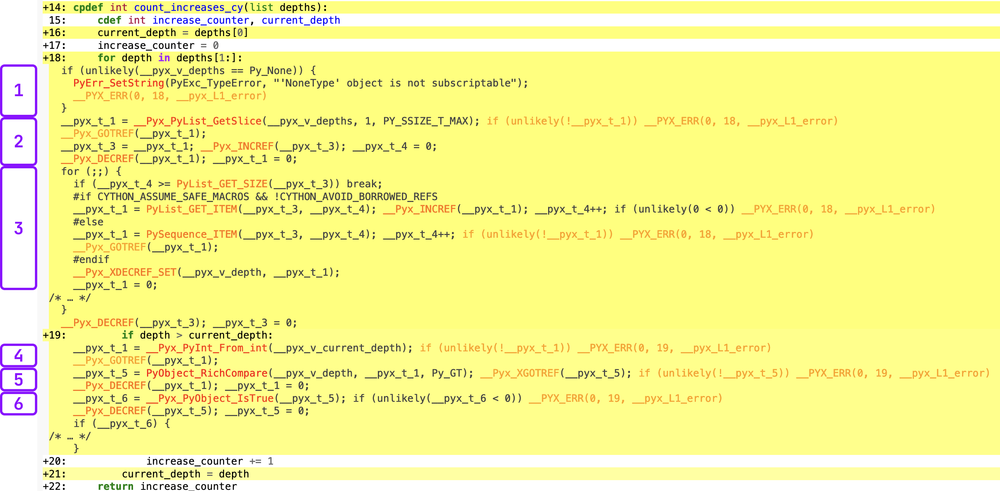

<meta name="twitter:card" content="summary">
<meta name="twitter:site" content="@pmbaumgartner">
<meta name="twitter:creator" content="@pmbaumgartner">
<meta name="twitter:title" content="An Introduction to Just Enough Cython to be Useful">
<meta name="twitter:description" content="or Why Don't More People Use Cython?">
<meta name="twitter:image" content="https://i.ibb.co/LYz2DyQ/1537215809678.jpg">

Since starting work at [Explosion](), I've been trying to learn more about Cython. About 16% of spaCy's codebase is Cython, so I decided to pick up [a book](https://www.amazon.com/dp/B00SNS9JFI/ref=dp_kinw_strp_1) and learn from that. I did a few example projects and started thinking: now that types are _cool_ in python, why don't more people use Cython? 

In case you're unfamiliar with Cython, here's my incremental and oversimplified explanation of what Cython can do:

1. If you're willing to add a compilation step, you can get a 2-3x speedup on your existing python code.
2. If you're willing to do (1), and type the variables and functions used in your code, you can get a 10x speedup. 
3. If you're willing to do (1) and (2), and spend some time thinking about your code and some computer science ideas, you can get a significant (50x or more) speedup.

In this blog post I'll walk you through all three of these incremental approaches in solving a problem using Cython. The problem we're going to solve is the first problem from [Advent of Code 2021](https://adventofcode.com/2021/day/1). The problem is to take a list of integers (`depths`) and count the number of times each value in the list is higher than the previous value. Here's the code for my initial solution:

```python
# solution.py 
from typing import List

def count_increases(depths: List[int]) -> int:
    current_depth = depths[0]
    increase_counter: int = 0
    for depth in depths[1:]:
        if depth > current_depth:
            increase_counter += 1
        current_depth = depth
    return increase_counter
```

## Getting Started

There are a few routes to getting started with Cython. The main difference in a workflow that uses Cython is that a compilation step is now required.[^1][^2] I'll assume you have are working through an IDE with typical python files.

To get started, we'll need to do three things:
1. Install cython (`pip install cython`)
2. Create a copy of your python code with a `.pyx` extension. For this example, lets say our source file is `solution.py`, we'll create `solution.pyx`.
    - If you want to benchmark, rename the pyx file to something distinct like `solution_cy.pyx`, so you can import it specifically.
3. Define the compilation step in a `setup.py`
4. Run the compilation step

Step 3 requires some detail. I added a build step through a `setup.py` file, which looks like this:

```python
# setup.py

from distutils.core import setup
from Cython.Build import cythonize

setup(
    ext_modules=cythonize(
        "solution.pyx", compiler_directives={"language_level": "3"}
    )
)
```

Once you have this file, you will actally run the compile step with the following command:

```bash
python setup.py build_ext --inplace
```

This will create a shared object file (`.so`) on the python search path. Now, in another python script or REPL, we can do `import solution` and call `solution.count_increases(input_depths)`.

To review, all we've done is taking existing python code, changed the file extension, and compiled the code. What did we get from it? In local benchmarks,[^3] the pure python version took `1.37s` and the compiled version took `0.61s`, a `2.22x` speedup.

To recap: we got a 2x speedup by compiling our existing python code with cython.

## Typing with C Types

Next, we'll type our function with C types. For a overview of available types, check the [Cython documentation](https://cython.readthedocs.io/en/latest/src/userguide/language_basics.html#types). 

First I'll show the code, then walk through what has changed.

```cython
# solution.pyx

cpdef int count_increases_cy(list depths):
    cdef int increase_counter, current_depth, depth
    current_depth = depths[0]
    increase_counter = 0
    for depth in depths[1:]:
        if depth > current_depth:
            increase_counter += 1
        current_depth = depth
    return increase_counter
```

First is the the `cpdef` keyword to define the function. This essentially creates a C function, with python syntax, and also creates a python wrapper for that function. If we just used `cdef` for the fuction, we would define a C function but it wouldn't be callable from python. Defining functions with `cdef` is helpful if you had smaller functions that were used inside of any `cpdef` functions that could operate solely on C types, and you knew they would not need to be called from python.

After `cpdef` you'll see the the `int` type, which in Cython syntax declares the return type of the function. One thing you'll notice is that the types are in a different order than they are if you're used to typing things for `mypy` in python. This also applies to the function arguments, which take their type before their name—in this case we're declaring `depths` as a `list`, but the keyword comes before the name, not after.

The first line of the function declares the variables and their types of all the variables we'll use within the function. If we had multiple variables of different types, we would have several lines that look like this.[^4] One thing to note here is that we also declare the type of the variable used within the for loop (`depth`). Since the input type of `depths` is only a `list`, we don't know the types of its contents within the function—we only know it's a collection of python objects.

The remainder of the function is the same, so in total we've added a single line that types our object and changed the function signature to match Cython's syntax. As a result of these changes, this function (once compiled) runs in `0.122s`, a `11.3x` speedup.

## Profiling and Exploring Python Calls in Cython Code

Those two lines of code updates took me a few hours to figure out as a first-time Cython user, especially the part about typing the variable in the for-loop.[^5] One thing that helped me is Cython's `annotate` feature. When you compile your code, you can add `annotate=True` to the `cythonize` call, and it will output a helpful HTML report, highlighting in yellow anywhere your code interacts with python, aka _the slow parts_.

You can also click and expand any lines in the report to see the underlying C code. Here's an example, **without typing the `depth` variable** with the for-loop line expanded and the C-code annotated.

[](cython-annotate-1.png)
<small>Click image to view full size. I promise this is worth reading along with the next section.</small>

In order to progress to the next stage of optimization, we need to spend some time reviewing this output. I've broken the C code into 6 chunks. Chunks 1-3 align with the for-loop, and 4-6 align with the comparison of `depth > current_depth`. Remember that this is the code that **did not type `depth`, the for-loop variable** yet.

1. For python built-in types passed as arguments, Cython automatically checks if they're `None`. There's currently no way to disable this, but I'm not sure if it's a big deal.[^6]
2. A series of variables are created that will allow us to iterate through the loop, e.g. counter variables. 
3. The actual loop. This is surpsingly readable if you break it apart and ignore the reference counting. First it checks if the iteration counter (`__pyx_t_4`) is larger than the size of the list, and if it is, stop looping. Then we're getting the python object from the sequence (as a slice), storing it as `__pyx_t_1`, and increasing the iteration counter.
4. Now we're doing the `depth > current_depth` comparison. First, it's converting `current_depth`, which is typed as a C `int`, to a python `int`. This is the first cause of the slowdown, since we didn't type `depth` with a C type, we have to convert `current_depth` back to python to make the comparison.
5. It's calling [`PyObject_RichCompare`](https://docs.python.org/3/c-api/object.html?highlight=pyobject%20rich%20compare#c.PyObject_RichCompare) to compare the two python objects, and storing the result of this function as `__pyx_t_5`. Remember, _we_ know that they're two integers, but C does not.
6. Finally, it's calling `__Pyx_PyObject_IsTrue` on `__pyx_t_5`. Remember, at this point this is still a python object so it's evaluating whether than python object is `True` (not the C type).

Now that we've done that review, we know there are two primary parts of our code that make python calls and are slow. We have a python list that we don't know the length of and can contain any type of object, and in this example we did not type `depth`, so we have to infer it's type and convert `current_depth`—a C `int`—back to a python `int` to make the comparison.

## The Final Optimization: Numpy Arrays & Memoryviews

Arrays in `numpy` have the exact features to address our slowdowns: they're of a fixed size and every element is the same type. They're also [easy to work with in Cython](https://cython.readthedocs.io/en/latest/src/userguide/numpy_tutorial.html#numpy-tutorial). Specifically, if we use `numpy` arrays we can use something called a `memoryview`, which is just a view into the array, so it doesn't require us create a copy of the array and allows for really quick indexing.

In order to use numpy with Cython, we need to update our compilation script in `setup.py` to the following:

```python
# setup.py

from distutils.core import setup
from Cython.Build import cythonize
import numpy

setup(
    ext_modules=cythonize(
        "solution_a_cy.pyx", compiler_directives={"language_level": "3"}, annotate=True
    ),
    include_dirs=[numpy.get_include()],
)
```

We'll update our code as follows:

```cython
# solution.pyx

cpdef int count_increases_cy_array(int[:] depths):
    cdef int increase_counter, current_depth, depth, length, i
    length = depths.shape[0]
    current_depth = depths[0]
    increase_counter = 0
    for i in range(1, length):
        if depths[i] > current_depth:
            increase_counter += 1
        current_depth = depths[i]
    return increase_counter
```

The first difference is that the type of the argument passed to our function is `int[:]`, which is the [syntax](https://cython.readthedocs.io/en/latest/src/userguide/memoryviews.html#syntax) for a `memoryview` of an array. This might be a little confusing because we're going to actually pass a `numpy` array as the argument[^7], not a memoryview, but it works regardless. Next, we have some additional variables to create. The two new variables, `length` and `i`, allow us to loop through the array and read the value in the array at each index. It's slightly more verbose than depending on the basic `for` loop, but is required if we're going to use an array in this way.

Let's take a look at the C code generated from this function. I've expanded the two lines we expanded in the previous image: the for-loop and comparison.

[](cython-annotate-2.png)

This is much more readable and it tracks very closely with what we have in the python code. More importantly there are no more calls to python within our loop code. It's doing exactly the simple operation we expect it to: making a comparison between two C `int`s.

For the final speedup comparison, this version of the function runs in `0.157s`, an `86x` speedup compared to the pure-python version.

## Wrap Up: Tempering Expectations

Optimizing code like this is always a thrilling adventure, but it leads back to my original question: why isn't more stuff written with Cython? 

I'd like to point out that not all production code is a simple for loop, conditional logic, and a counter. We have a very simple, isolated problem that lent itself well to illustrating the advantages of Cython. Additionally, it certainly takes some time and energy to come up with these improvements. Sure, you can get a `2x` speedup by compiling your normal python code, but the real value is in an `86x` speedup on commonly used code. 

Let me summarize and rephrase by quoting from the Cython book I'm reading, from which I shamelessly stole the "Tempering Expectations" section name:

> When improving Python’s performance is the goal, the Pareto principle works in our favor: we can expect that approximately 80 percent of a program’s runtime is due to only 20 percent of the code. A corollary to this principle is that the 20 percent is very difficult to locate without profiling.
>
> **p. 7**

The fact is: only 16% of `spaCy` is written in Cython and the rest is python. While that 16% is code that's called very often and a core part of the library, for most everything else using and maintaining python code is much easier to manage. With that python code, we get all the additional features of python plus the rest of the ecosystem. Plus we don't have to consider whether every new feature or component is optimized in Cython or compile a larger part of the library when developing.

In summary, Cython is really cool but I'll only be thinking about using it when:

- I have profiled my code and identified parts of the code that are slow.
- Those parts of the code use mostly python built-in types or numpy arrays.
- Those parts of the code are simple so I wouldn't have to spend much time thinking about how to Cython-ize it.
- Those parts of the code aren't going to be under frequent future development.


[^1]: If you're into interactive computing, via `ipython` or `jupyter notebooks`, there is a [`%%cython`](https://ipython.org/ipython-doc/2/config/extensions/cythonmagic.html) magic you can use.
[^2]: There is also [`pyximport`](https://cython.readthedocs.io/en/latest/src/userguide/source_files_and_compilation.html#compiling-with-pyximport), which is included with Cython. However, I couldn't get it working in the way I wanted it, so it's not included in this blog post.
[^3]: I have a M1 MBP. For benchmarking, I used the min value of timeit with 5 repeats of 20000 executions.
[^4]: There's also an [alternative block syntax](https://cython.readthedocs.io/en/latest/src/userguide/language_basics.html#grouping-multiple-c-declarations) for declaring multiple variables.
[^5]: This is the most critical typing required in the function for a speedup. Without this type, we have to infer the type of the object each iteration. If you exclude this typing (but keep all the others), the speedup is back to the compiled python code version at `~2.2x`
[^6]: https://github.com/cython/cython/issues/3797
[^7]: Don't forget to add the conversion of the input to a numpy array to your execution script.